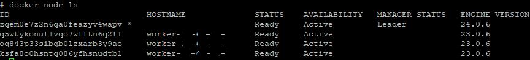
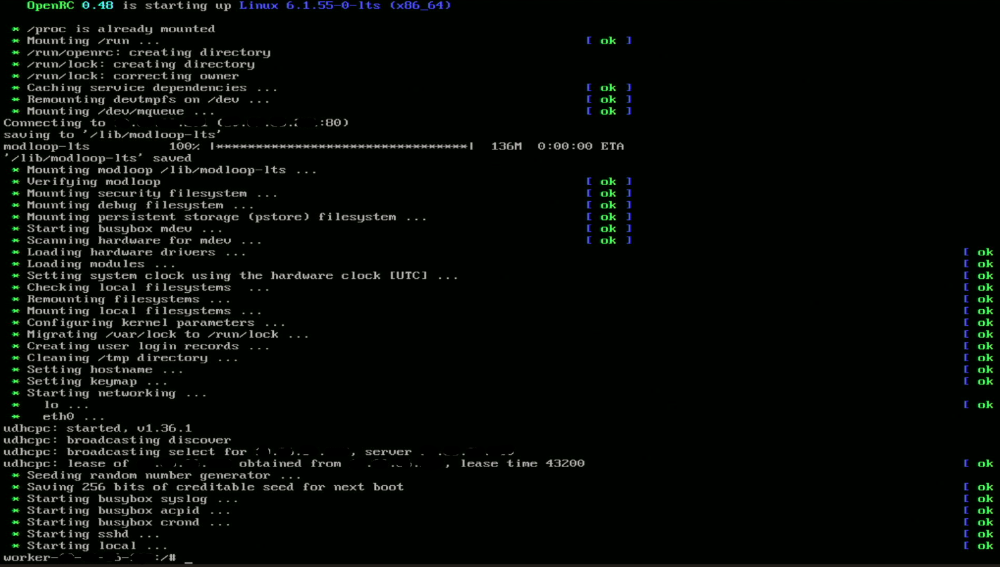

# NetBooted Swarm
This is a guide to setup
* server
  *  ubuntu lts server with the netboot files and the docker swarm leader
  *  requies at least
    *  2-core cpu
    *  2 gb memory
    *  40 gb storage for a basic config
    *  gigabit networking
* worker(s)
  * any number of netbooted clients that will boot from the server and attach to it as a docker swarm node
  * requires at least
    * 2 core cpu
    * memory as needed
    * gigabit networking
    * NO DISK
   
I am running this on a set of HP T520 with a sodimm of 8 gb ram ( https://www.parkytowers.me.uk/thin/hp/t520/ )

On the server



On each worker



# May thanks to
netboot server 
* https://www.youtube.com/watch?v=xmVGIdScCQA
* https://www.apalrd.net/posts/2022/alpine_pxe/#download--configure-ipxe
* 
netboot apkvol based on
* https://www.apalrd.net/posts/2022/alpine_vdiclient/
* https://www.youtube.com/watch?v=r-TnP06K-gE

Docker swarm cleanup script
* https://gist.github.com/sxiii/4f60940d257c31ca0ff071c1a015eab2

# Install Ubuntu Server LTS minimal install
... there are plenty of guides on this. Just make sure to set a static ip

If you want to use alpine then use the videos and docs in the thank you section as reference.

If you want to use something else (i would recommend debian) feel free to do so. I used ubuntu server because it was already installed

# About this guide

I tried many things until i got everything working properly. This is a compilation of my nodes and there might be some mistakes. Please open a issue if you find any mistakes/errors. Also this guide is for experienced linux users - if you want to understand what each command does below then please use a search engine - many people will have better answers than i do.

# After first boot install some useful tools
```
apt remove -y --autoremove snapd
apt update
apt upgrade -y
apt install -y \
  dialog \
  screen \
  htop \
  nano \
  dnsutils \
  iputils-ping \
  net-tools \
  iperf \
  iputils-ping \
  cron
systemctl enable cron
```

# Install and configure netboot server components
```
apt-get install tftpd-hpa
mkdir -p /storage/tftp
chmod -R 777 /storage/tftp/
touch /storage/tftp/undionly.kpxe
```
edit /etc/default/tftpd-hpa

from
```
  TFTP_DIRECTORY="/srv/tftp"
```
to
```
  TFTP_DIRECTORY="/storage/tftp"
```

then restart tftp server
```
/etc/init.d/tftpd-hpa restart
```
next we'll configure a http server to keep our files
```
apt install nginx -y
mkdir /storage/www
chown -R www-data:www-data /storage/www
mv /etc/nginx/nginx.conf /etc/nginx/nginx.conf.bak
```

edit /etc/nginx/nginx.conf
```
worker_processes auto;
error_log /var/log/nginx/error.log warn;
pid /run/nginx.pid;

events {
    worker_connections 1024;
}

http {
    include /etc/nginx/mime.types;
    default_type application/octet-stream;
    sendfile on;
    access_log /var/log/nginx/access.log;
    keepalive_timeout 3000;
    server {
        listen 80;
        root /storage/www;
        index index.html index.htm;
        server_name localhost;
        client_max_body_size 32m;
        error_page 500 502 503 504 /50x.html;
        location = /50x.html {
            root /var/lib/nginx/html;
        }
    }
}
```
and restart ngingx
```
systemctl restart nginx
```


# Setup netboot os files

We'll use latest alpine, 3.18 at the point of this post
```
cd /storage/www
wget https://dl-cdn.alpinelinux.org/alpine/v3.18/releases/x86_64/alpine-netboot-3.18.4-x86_64.tar.gz
tar -xzf alpine*
rm alpine-netboot*
chown -R www-data:www-data /storage/www
```

# Build ipxe image for x86 / x64
```
apt install -y make gcc binutils perl mtools mkisofs syslinux liblzma-dev isolinux
cd /srv
git clone https://github.com/ipxe/ipxe.git
cd ipxe/src
```

edit netboot.ipxe
```
#!ipxe

#Init networking
dhcp

#Networking info we got from the DHCP server
echo next-server is ${next-server}
echo filaneme is ${filename}
echo MAC address is ${net0/mac}
echo IP address is ${ip}

#Set flavor to lts
set flavor lts
echo flavor is ${flavor}

#Set command line 
set cmdline modules=loop,squashfs quiet
echo cmdline is ${cmdline}

#Server address
set server http://${next-server}
echo server is ${server}

#Kernel file
set vmlinuz ${server}/boot/vmlinuz-${flavor}
echo vmlinuz is ${vmlinuz}
set initramfs ${server}/boot/initramfs-${flavor}
echo initramfs is ${initramfs}

#Modloop file
set modloop ${server}/boot/modloop-${flavor}
echo modloop is ${modloop}

#Repository for apk
#Update this if you'd like a newer version of Alpine
#Alternatively, set branch to edge for the absolutel latest
set mirror http://dl-cdn.alpinelinux.org/alpine
set branch v3.15
set repo ${mirror}/${branch}/main
echo repo is ${repo}

#apkovl file - set this if you want to apply
#an apkovl file to configure the Alpne instance
set apkovl ${server}/thinclient.apkovl.tar.gz
echo apkovl is ${apkovl}

#Uncomment this if you want to see the information before continuing
#prompt Press any key to continue

#Kernel, initrd
#For EFI, we need to tell the kernel the initrd filename. For BIOS it doens't hurt to leave the initrd argument.
#If you want to use Alpine bare, use this line:
#kernel ${vmlinuz} ${cmdline} alpine_repo=${repo} modloop=${modloop} initrd=initramfs-${flavor}
#If you want to use Alpine with an apkovl, use this line:
kernel ${vmlinuz} ${cmdline} modloop=${modloop} apkovl=${apkovl} initrd=initramfs-${flavor}
initrd ${initramfs}

#Boot
boot

#Pause if errors
prompt Some error occurred, press any key to continue
```

edit build.sh
```
#Build BIOS version (x86 but should boot into x64 environment)
make bin-i386-pcbios/undionly.kpxe EMBED=netboot.ipxe
cp bin-i386-pcbios/undionly.kpxe /storage/tftp/

#Build EFI version (x86)
#make bin-x86_64-efi/ipxe.efi EMBED=netboot.ipxe
#cp bin-x86_64-efi/ipxe.efi /storage/tftp/ipxe64.efi

#The APKOVL we are using is for x64, so not building ipxe32.efi right now
#Also not building arm variants for this project
```
I only needed the BIOS version but if you need EFI then also uncomment the make.. and cp.. lines under Build EFI

# Configure DHCP server
... here youre on your own, plenty of guides on how to do it for all routers. Set the server ip to the one you used on the ubuntu server above

# Trt it out
right now your pc/server/thin client that supports netboot should get an ip from dhcp and also netboot the os. alpine should complain about not having an apkvol and drop you a shell

# Install docker on ubuntu server

... plenty of guides out there

then run
```
docker swarm init
```
This will give you the swarm join command to add a node to your cluster. Save it - you'll need it later.


Next, let's setup docker swarm auto-removal of dead nodes 


create a .sh file somewhere and put it in cron every 1/2/5/etc minutes

I'm running this as root so i don't need any sudo and/or group management for docker access for other users.
```
docker node rm $(docker node ls | grep Down | awk -F" " '{ print $1 }')
```

# Creating an apkvol

I would recoomend you to watch the video about apkvol linked at the start of this document first.

Basically an apkvol is a tar.gz file which contains all the information needed to configure your freshly netbooted os and will be used to setup /etc/ files and automatically install packages

The apkvol should do these things
1. install a very minimal list of packages
2. download bash script hosted on the server after boot and run it

The script is what allows you to automatically setup things on the worker nodes without needing to rebuild the apkvol after every change

# What to install in apkvol
```
apk update
apk add nano openssh
rc-update add sshd
```
edit /etc/ssh/sshd_config and set permit root login to yes - we're only going to have single user on the worker nodes
```
service sshd start
```
at this point you can connect via ssh to this machine and configure the rest via ssh connection if it's more confortable for you

```
echo "http://dl-cdn.alpinelinux.org/alpine/v3.18/main" > /etc/apk/repositories
echo "http://dl-cdn.alpinelinux.org/alpine/v3.18/community" >> /etc/apk/repositories
apk update
rc-update add local default
apk add bash
```
if you want to be dropped in a shell after a worker boots you can edit /etc/inittab and update the tty1.. line to
```
tty1::respawn:/bin/bash
```
next we'll create the script that runs immediately after boot
```
touch /etc/local.d/q.start
chmod +x /etc/local.d/q.start
```
edit q.start script - replace the 192.168.100.100 with the ip address of the ubuntu server you installed
```
#!/bin/bash
wget -O "/tmp/q.sh" "http://192.168.100.100/q.sh"
chmod +x /tmp/q.sh
/bin/bash /tmp/q.sh | tee /tmp/q.log
sleep 10
/bin/bash /tmp/q.sh | tee /tmp/q.log
sleep 20
/bin/bash /tmp/q.sh | tee /tmp/q.log
```
we are running the script multiple times to make sure everything is setup properly

Now we need to generate the actual file and then copy it to the ubuntu server. I usually save this script and run it to rebuild the file
* remove unneeded packages
* build the image
* copy the image to the ubuntu server
* add back the packages that were removed to allow easy editing
```
apk del nano
cd /
lbu package thinclient.apkovl.tar.gz 
scp /thinclient.apkovl.tar.gz root@192.168.100.100:/storage/wwww 
apk add nano
```
Yould also remove ssh but I leave it here since it's nice to be able to ssh into the nodes to check things

# q.start script on the server
edit /storage/www/q.sh
```
#!/bin/bash

## LOCAL IP

LOCALIP=$(/sbin/ifconfig eth0 | grep 'inet addr:' | cut -d: -f2| cut -d' ' -f1)
echo "Ip is $LOCALIP"

## HOSTNAME

NEWHOSTNAME=${LOCALIP//./-}
NEWHOSTNAME="worker-$NEWHOSTNAME"

HOSTNAME=$(cat /etc/hostname)
echo "Hostname should be $NEWHOSTNAME"
if [ "$HOSTNAME" = "$NEWHOSTNAME" ]; then
  echo " ... ok"
else
  echo " ... is $HOSTNAME, updating..."
  echo $NEWHOSTNAME > /etc/hostname
  hostname -F /etc/hostname
  echo " ... changed to $NEWHOSTNAME"
  echo " ... updating /etc/hosts"
  echo "127.0.0.1       $NEWHOSTNAME"   > /etc/hosts
  echo "::1             $NEWHOSTNAME"   >> /etc/hosts
fi
```
This should set the hostname of each netbooted worker to worker-<ip address with - instead of .>. This name will also be the node name in docker, making things a bit easier to manage.

For example if a worker boots with 192.168.100.11 then it will run with hostname worker-192-168-100-11

# Testing the apkvol
Reboot your netboot worker. It should netboot then download the apkvol and apply it then run the script and drop you into a shell prompt for root.

# Now we'll just have to update the q.sh script to add more things in it
edit q.sh on server and append the following contents to the existing file. Do not forget to replace the "docker swarm join ...." line with the actual command you saved (you did save it, right?) when you created the swarm
```
## DOCKER installed ?

if test -f "/usr/bin/docker"; then
  echo "docker exists"
else
  echo "installing docker"
  apk add --update docker openrc
  sleep 1
  rc-update add docker boot
  sleep 1
  service docker start
  sleep 1
fi

## DOCKER started ?
pgrep -x containerd >/dev/null && echo "docker running already" || service docker start


## SWARM joined ?

TOJOIN="no"
case "$(docker info --format '{{.Swarm.LocalNodeState}}')" in
  inactive)
    echo "Node is not in a swarm cluster"
    TOJOIN="yes"
    ;;
  pending)
    echo "Node is not in a swarm cluster"
    TOJOIN="yes"
    ;;
  active)
    echo "Node is in a swarm cluster";;
  locked)
    echo "Node is in a locked swarm cluster";;
  error)
    echo "Node is in an error state"
    TOJOIN="yes"
    ;;
  *)
    echo "Unknown state $(docker info --format '{{.Swarm.LocalNodeState}}')"
    TOJOIN="YES"
    ;;
esac

if [ "$TOJOIN" = "no" ]; then
  echo " ... NOT trying to join swarm"
else
  echo " ... trying to JOIN swarm!"
  docker swarm join ....
  sleep 1
  echo "Docker status is now ...."
  $(docker info --format '{{.Swarm.LocalNodeState}}')
fi
```

# Enjoy!
If you reboot your worker or just run the /etc/local.d/q.sh script again you should have docker installed, started and joined the swarm.

You can check this by running on the server
```
docker node ls
```
and see your net booted nodes started

# Advanced topics
For more advanced topic see the rest of the readme files that will be added soon to this git


